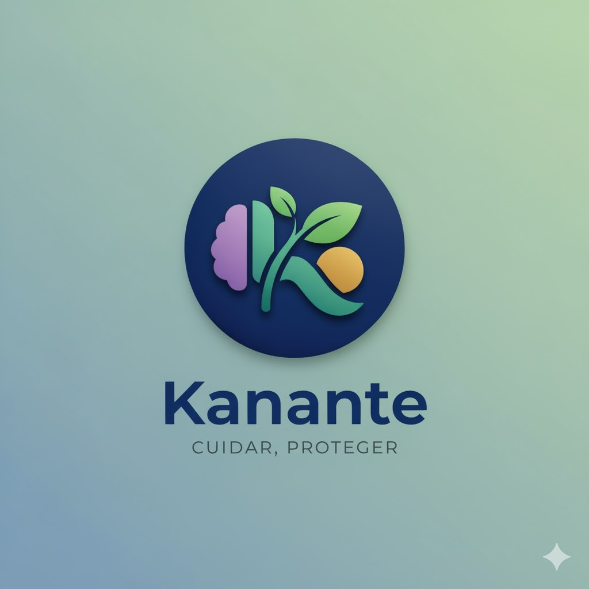

<div align="center">
  
  <h1 align="center">Kanante App</h1>
  <p align="center">
    Una aplicación móvil construida con Flutter para conectar usuarios y profesionales del bienestar.
    <br />
    <a href="https://github.com/Angelgonzalez2004/Kanante_app"><strong>Explora la documentación »</strong></a>
    <br />
    <br />
    <a href="https://github.com/Angelgonzalez2004/Kanante_app/issues">Reportar Bug</a>
    ·
    <a href="https://github.com/Angelgonzalez2004/Kanante_app/issues">Solicitar Feature</a>
  </p>
</div>

## 📜 Descripción

**Kanante App** es una plataforma móvil, construida con Flutter y Firebase, diseñada para ser un ecosistema de bienestar integral. Facilita la conexión entre usuarios que buscan servicios de salud mental y bienestar y los profesionales que los ofrecen. La aplicación permite a los profesionales verificados crear contenido, gestionar su perfil y agenda, mientras que los usuarios pueden buscar profesionales, consumir su contenido, agendar citas y comunicarse de forma segura.

Con las mejoras recientes, la aplicación ofrece una **experiencia de usuario estabilizada y refinada**, con un flujo de autenticación robusto, un diseño adaptable y una gestión de contenido y comunicación eficiente para todos los roles.

La aplicación está estructurada en tres roles principales:
*   **👤 Usuario:** Busca y contacta profesionales, agenda citas, consume el feed de contenido, gestiona su perfil y accede a soporte y FAQs.
*   **🧑‍⚕️ Profesional:** Publica artículos en el feed, gestiona su perfil (biografía, especialidades), su agenda de citas, se comunica con los usuarios y solicita la verificación de su cuenta.
*   **👑 Administrador:** Modera el contenido, gestiona las verificaciones de los profesionales, supervisa tickets de soporte y chats de la plataforma.

## ✨ Características Principales

*   **🚀 Flujo de Inicio de Aplicación Mejorado:** La aplicación ahora sigue un flujo claro de `Splash Screen` (logo) -> `Welcome Screen` (información atractiva) -> `Login Screen`. La `Welcome Screen` es la puerta de entrada principal para nuevos usuarios o aquellos que desean iniciar sesión, y la `Login Screen` permite regresar a la `Welcome Screen`.
*   **🔐 Autenticación Multi-plataforma:** Registro e inicio de sesión con correo/contraseña y Google Sign-In, con flujos seguros y persistencia de sesión.
*   **🎨 Diseño Responsivo y Adaptativo:** Interfaz de usuario completamente responsiva que se adapta a móviles, tabletas y web, utilizando `LayoutBuilder` para cambiar entre menús laterales (`Drawer`) y barras de navegación persistentes (`NavigationRail`) para una experiencia de usuario óptima.
*   **👤 Perfiles y Configuraciones Claramente Separados:**
    *   **Páginas de Perfil:** Dedicadas a la información de identidad del usuario (nombre, teléfono, foto de perfil, biografía, etc.). Ahora con campos editables como género, fecha de nacimiento (con selector de calendario), teléfono y RFC.
    *   **Redes Sociales para Profesionales:** Una nueva sección en el perfil del profesional permite añadir y mostrar enlaces a sus redes sociales (Facebook, Instagram, TikTok, WhatsApp, Correo electrónico) con iconos interactivos y enlaces funcionales.
    *   **Páginas de Configuración:** Enfocadas en las preferencias y el comportamiento de la aplicación (notificaciones, tema, seguridad, cerrar sesión, etc.). Ahora incluyen un indicador de estado de verificación y navegación a la política de privacidad.
    *   **Gestión de Fotos de Perfil:**
        *   Solo los **Profesionales con cuentas manuales** pueden subir, cambiar y eliminar su foto de perfil directamente en la aplicación.
        *   Los usuarios con **cuentas de Google** (tanto Usuarios como Profesionales) deben gestionar su foto directamente desde su cuenta de Google; la app no permite la subida en estos casos.
        *   Los **Usuarios Normales y Administradores** no pueden subir fotos de perfil, aunque sus perfiles las mostrarán si existen (e.g., de una cuenta de Google).
*   **✅ Sistema de Verificación:** Los profesionales deben subir documentos para ser verificados por un administrador, aumentando la confianza y seguridad en la plataforma.
*   **📝 Feed de Contenido Dinámico:** Los profesionales pueden crear, editar y publicar artículos con un editor de texto enriquecido e imágenes. Los usuarios pueden explorar este contenido en un feed interactivo.
*   **🗓️ Gestión de Citas:** Sistema para que los usuarios soliciten citas y los profesionales las gestionen. Ahora con la posibilidad de solicitar cita directamente desde el chat con un profesional, y **opciones para cancelar o reprogramar citas** para ambos roles.
*   **💬 Chat en Tiempo Real:** Comunicación directa y segura entre usuarios y profesionales, y entre usuarios y el equipo de soporte. Ahora incluye **recibos de lectura e indicadores de escritura** para una experiencia más fluida.
*   **🧭 Navegación por Roles:** Paneles de control (`Dashboards`) personalizados para cada rol (Usuario, Profesional, Administrador), mostrando solo las opciones y vistas relevantes para cada uno.
*   **🔍 Búsqueda y Filtro de Profesionales:** Los usuarios pueden **buscar y filtrar profesionales por nombre, especialidad y email**, facilitando la conexión con el especialista adecuado.
*   **⭐️ Sistema de Calificación y Reseñas:** Los usuarios pueden **calificar y dejar reseñas** sobre los profesionales después de las citas. Los perfiles de los profesionales muestran su **calificación promedio** y una lista de todas las reseñas.
*   **🆘 Soporte y Ayuda Integrado:**
    *   Chat directo con administradores de soporte.
    *   Formularios de quejas y sugerencias (anónimos o identificados).
    *   Acceso a políticas de privacidad.
    *   Secciones de Preguntas Frecuentes (FAQ) personalizadas por rol.
    *   **Nueva Sección "Sobre Nosotros"**: Conoce la misión, origen e información de contacto de Kananté.

## 🚀 Nuevas Características y Mejoras Recientes

Hemos implementado una serie de mejoras significativas en la aplicación para enriquecer la experiencia de usuario y la funcionalidad en todos los roles:

*   **¡Estabilidad del Flujo de Autenticación y Navegación!**
    *   Se implementó un `AuthWrapper` robusto como punto de entrada único de la aplicación, centralizando la gestión del estado de autenticación y el redireccionamiento por roles.
    *   El `login_screen.dart` ha sido refactorizado para eliminar conflictos de navegación, permitiendo que el `AuthWrapper` controle de manera exclusiva el redireccionamiento post-autenticación.
    *   Se mitigaron las condiciones de carrera que causaban redirecciones intermitentes a la pantalla de bienvenida o a un estado de sesión inconsistente.
    *   **Corrección de Redirección para Google Sign-In:** Se solucionó un problema donde los usuarios que iniciaban sesión con Google eran redirigidos incorrectamente a la pantalla de bienvenida en lugar de sus paneles de control basados en roles. Ahora, los roles se asignan y reconocen correctamente.
    *   **Suspensión Temporal de Google Sign-In:** La opción de inicio de sesión con Google ha sido suspendida temporalmente de la interfaz de usuario en `LoginScreen` para enfocarse en la autenticación tradicional con correo y contraseña.
*   **✅ Estabilidad y Mantenimiento del Código:**
    *   Resolución de todos los errores, advertencias y lints críticos reportados por `flutter analyze`, asegurando un código base más robusto y limpio.
    *   **Limpieza de Código y Lints:** Se corrigieron errores de sintaxis (`expected_token`), uso de elementos deprecados (`withOpacity`), y problemas de orden de propiedades (`sort_child_properties_last`). Además, se eliminaron importaciones y declaraciones de código no utilizados para mantener la limpieza del proyecto.
*   **¡Mejoras en la Experiencia de Usuario (UI/UX)!**
    *   **Dashboards Renovados:** Los dashboards de Usuario y Profesional han sido pulidos, con una tematización consistente (uso de `Colors.indigo` para un aspecto más profesional).
    *   **Cabeceras Consistentes:** Se implementaron cabeceras personalizadas y reutilizables en los `Drawer` y `NavigationRail` de los dashboards, proporcionando un diseño moderno y unificado.
    *   **Home Page Rediseñada:** Se eliminaron los botones de acceso rápido de la pantalla principal (`HomePage`) y se reemplazaron por tarjetas informativas estáticas, mejorando la presentación del contenido.
    *   **Navegación sin Duplicidad:** Se eliminaron los `AppBar` redundantes de las pantallas internas cargadas en los `IndexedStack` de los dashboards, asegurando una única barra superior por pantalla principal, conforme a las mejores prácticas de navegación.
    *   **Flujo de Cierre de Sesión Guiado:** Al cerrar sesión, el usuario ahora recibe un mensaje de confirmación de 3 segundos antes de que se complete el `signOut`, proporcionando una retroalimentación clara.
*   **¡Actualización de Preguntas Frecuentes (FAQ)!**
    *   Se ha expandido el contenido de la sección de FAQ, añadiendo nuevas categorías y preguntas/respuestas relevantes para los roles de Usuario, Profesional y Administrador (Ej: "Resolución de Problemas", "Crecimiento y Visibilidad", "Seguridad y Políticas").
*   **Manejo de Imágenes en Publicaciones:**
    *   Se corrigió el error "Exception: Invalid image data" al registrar publicaciones con URLs de imágenes. La aplicación ahora maneja correctamente tanto imágenes locales (subiéndolas a Firebase Storage) como imágenes externas (guardando directamente la URL).
*   **✅ Estabilidad y Mantenimiento del Código:**
    *   Resolución de todos los errores, advertencias y lints críticos reportados por `flutter analyze`, asegurando un código base más robusto y limpio.
    *   Corrección del error de tiempo de ejecución "No Material widget found" en pantallas de contenido principal, envolviendo sus cuerpos en widgets `Material`.
    *   Refinamiento de `UserProfilePage` para cargar datos internamente, eliminando la necesidad del parámetro `userData`.
    *   Eliminación de errores de argumentos duplicados y aplicación de las mejores prácticas de sintaxis (`curly_braces_in_flow_control_structures`).

## 🛠️ Tecnologías Utilizadas

Este proyecto está construido con una pila de tecnologías modernas para el desarrollo de aplicaciones multiplataforma:

*   **Framework:** [Flutter](https://flutter.dev/)
*   **Lenguaje:** [Dart](https://dart.dev/)
*   **Backend:** [Firebase](https://firebase.google.com/)
    *   **🔥 Autenticación:** Firebase Auth (Email/Password & Google Sign-In)
    *   **🗄️ Base de Datos:** Firebase Realtime Database
    *   **📦 Almacenamiento:** Firebase Storage
*   **Gestión de Estado:** [Provider](https://pub.dev/packages/provider)
*   **Mapas:** [Google Maps Flutter](https://pub.dev/packages/google_maps_flutter)
*   **Editor de Texto:** [Flutter Quill](https://pub.dev/packages/flutter_quill)

## 🚀 Comenzando

Para obtener una copia local y ponerla en marcha, sigue estos sencillos pasos.

### Prerrequisitos

Asegúrate de tener instalado el SDK de Flutter y las herramientas de línea de comandos de Java (`keytool`) en tu `PATH`. Para más información, consulta la [documentación oficial de Flutter](https://flutter.dev/docs/get-started/install).

*   Flutter SDK
*   Java Development Kit (JDK)

### Configuración de Firebase

Este proyecto requiere una configuración de Firebase para funcionar. **No podrás ejecutar la aplicación sin completar estos pasos.**

1.  **Crear un Proyecto en Firebase:**
    *   Ve a la [Consola de Firebase](https://console.firebase.google.com/) y crea un nuevo proyecto.
    *   Habilita los siguientes servicios: **Authentication** (con proveedores de Email/Contraseña y Google), **Realtime Database**, y **Firebase Storage**.

2.  **Configurar la App para Android:**
    *   En la configuración de tu proyecto de Firebase, añade una nueva aplicación de Android con el `package name`: `com.example.kanante_app`.
    *   Genera una huella digital de certificado **SHA-1** para tu keystore de depuración. Puedes obtenerla ejecutando el siguiente comando en tu terminal:
        ```sh
        keytool -list -v -keystore "%USERPROFILE%\.android\debug.keystore" -alias androiddebugkey -storepass android -keypass android
        ```
    *   Añade esta huella digital SHA-1 a la configuración de tu app de Android en Firebase.
    *   Descarga el archivo `google-services.json` y colócalo en el directorio `android/app/` de tu proyecto.

3.  **Configurar la App para iOS:**
    *   En Firebase, añade una nueva aplicación de iOS con el `bundle ID`: `com.example.kananteApp`.
    *   Descarga el archivo `GoogleService-Info.plist` y colócalo en el directorio `ios/Runner/` de tu proyecto usando Xcode.

4.  **Configurar la App para Web:**
    *   En Firebase, añade una nueva aplicación Web.
    *   Ve a la [Consola de Google Cloud](https://console.cloud.google.com/), selecciona tu proyecto, y en **APIs y servicios > Credenciales**, crea un nuevo **ID de cliente de OAuth 2.0** para "Aplicación web".
    *   Copia el **ID de cliente** generado (un string que termina en `.apps.googleusercontent.com`).
    *   Abre el archivo `web/index.html` y reemplaza el marcador de posición en la siguiente etiqueta meta:
        ```html
        <meta name="google-signin-client_id" content="YOUR_WEB_CLIENT_ID_HERE">
        ```
    *   **Habilitar People API:** En la consola de Google Cloud, ve a **APIs y servicios > Biblioteca** y busca y habilita la **People API**.

### Instalación

1.  Clona el repositorio:
    ```sh
    git clone https://github.com/Angelgonzalez2004/Kanante_app.git
    ```
2.  Navega al directorio del proyecto:
    ```sh
    cd Kanante_app
    ```
3.  Instala las dependencias:
    ```sh
    flutter pub get
    ```
4.  Ejecuta la aplicación en el dispositivo deseado:
    ```sh
    flutter run
    # Para web
    flutter run -d chrome
    ```

## 📂 Estructura del Proyecto

La estructura del proyecto está organizada para mantener una separación clara de responsabilidades, siguiendo las mejores prácticas de Flutter.

```
├── lib
│   ├── data            # Datos estáticos (ej. FAQs)
│   ├── models          # Clases de modelo de datos (Usuario, Cita, etc.)
│   ├── screens         # Widgets de pantalla principal para cada flujo de la app
│   │   ├── admin
│   │   ├── professional
│   │   ├── shared
│   │   └── user
│   ├── services        # Lógica de negocio y servicios (e.g., FirebaseService)
│   ├── theme           # Definiciones de tema y colores de la app
│   └── widgets         # Widgets reutilizables (botones, campos de texto, etc.)
├── assets              # Archivos estáticos como imágenes y fuentes
├── pubspec.yaml        # Definiciones y dependencias del proyecto
```

## 📄 Licencia

Distribuido bajo la Licencia MIT. Consulta `LICENSE` para más información.

## 📧 Contacto

Link del Proyecto: [https://github.com/Angelgonzalez2004/Kanante_app](https://github.com/Angelgonzalez2004/Kanante_app)